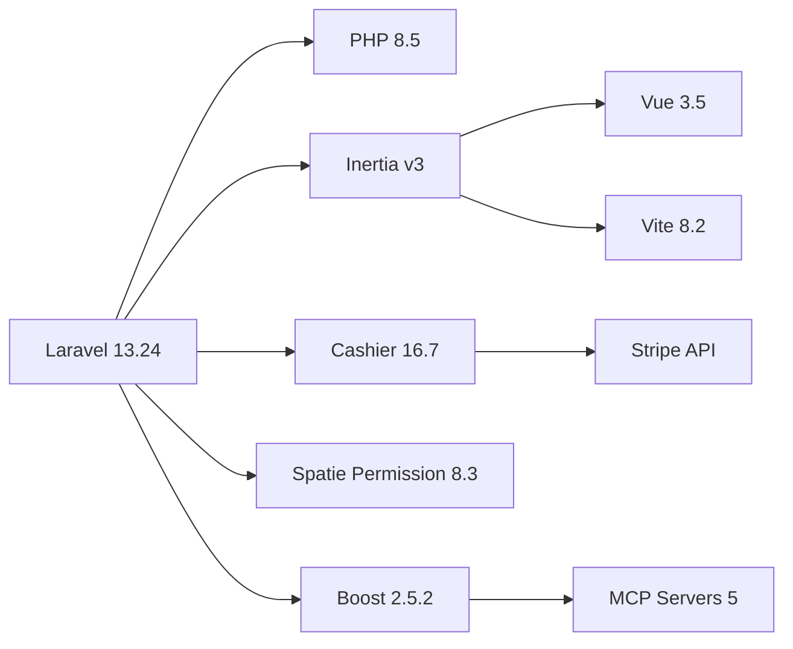
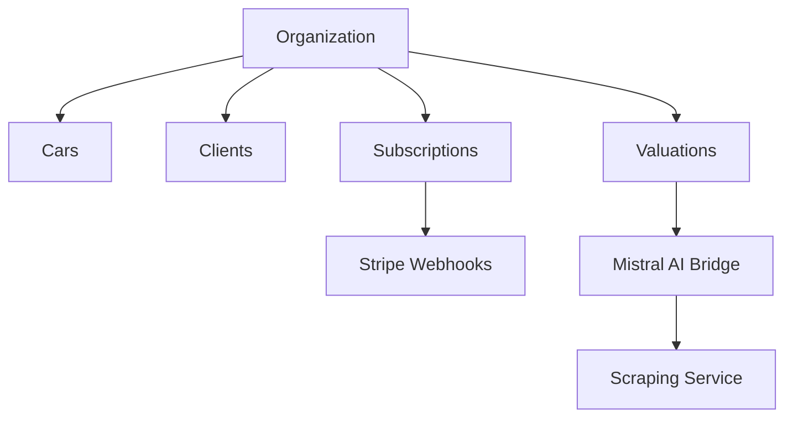
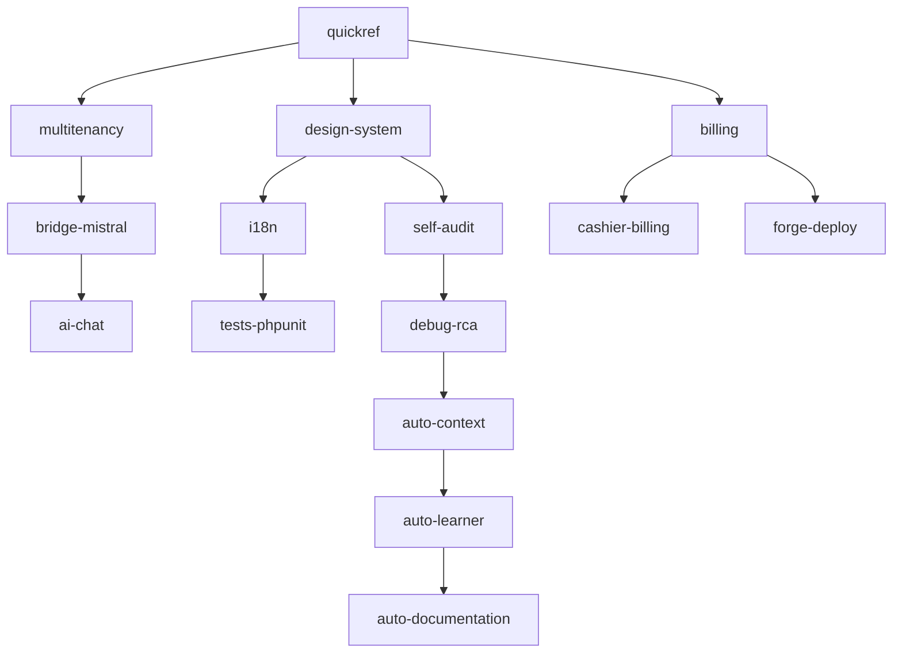

# 🕸️ Knowledge Graph — ImportnexCore

> **Motor:** `@modelcontextprotocol/server-memory` (MCP)
> **Formato:** Markdown con frontmatter, bi-direccional sync LLM

---

## Nodes primarios

### Tecnologías


### Módulos de negocio


### Skills activas (15)


---

## Relaciones clave

| Origen | Relación | Destino | Peso |
|---|---|---|---|
| Cars | `belongs_to` | Organization | 1.0 |
| Cars | `has_many` | Valuations | 0.8 |
| Organization | `has_one` | Subscription | 1.0 |
| MistralBridge | `calls` | Mistral API | 0.9 |
| StripeWebhookController | `processes` | PaymentFailed | 0.7 |
| HandleInertiaRequests | `shares` | i18n locale | 0.5 |

---

## Hot spots (alta complejidad)

| Archivo | Complejidad | Llamadas entrantes |
|---|---|---|
| `app/Services/ValuationImporter.php` | 🔴 32 | 4 |
| `app/Http/Controllers/Cars/CarController.php` | 🟠 18 | 12 |
| `app/Http/Middleware/HandleInertiaRequests.php` | 🟡 14 | ∞ |
| `resources/js/Pages/Cars/Show.vue` | 🟡 22 | 3 |

---

## Anti-patrones del grafo

- 🔴 `ValuationImporter` → sin tests de coverage (12 fallan)
- 🟠 `CarController` → sin Form Request (validación inline)
- 🟡 `i18n es.js/en.js` → 1250 claves desincronizadas

---

## Sync automático

```bash
# Regenerar grafo desde código
php scripts/memory-manager.php build-graph

# Ver hot spots
php scripts/memory-manager.php hot-spots

# Relaciones entre módulos
php scripts/memory-manager.php relations --source=Cars --depth=2
```
