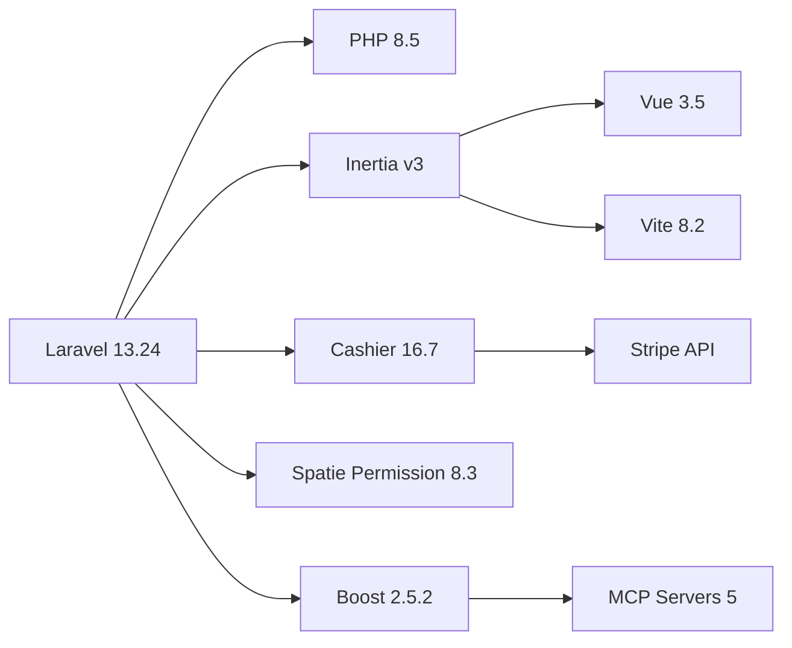
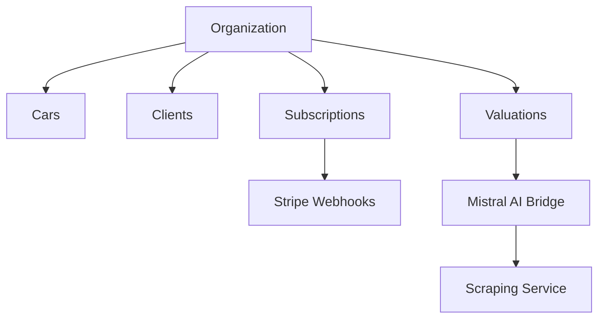
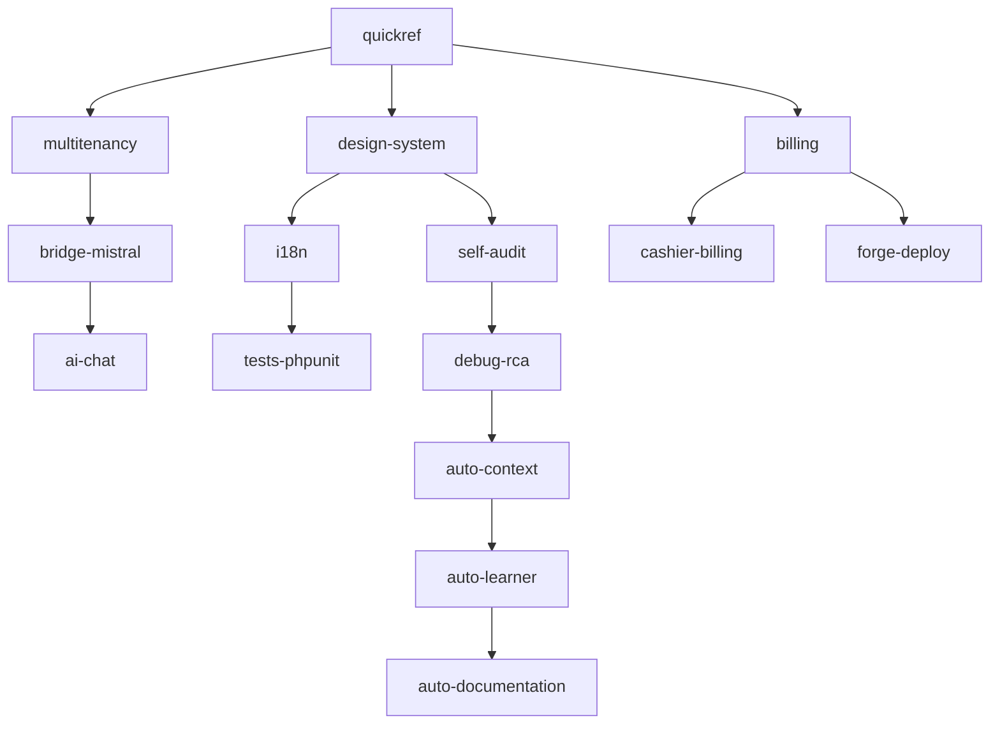
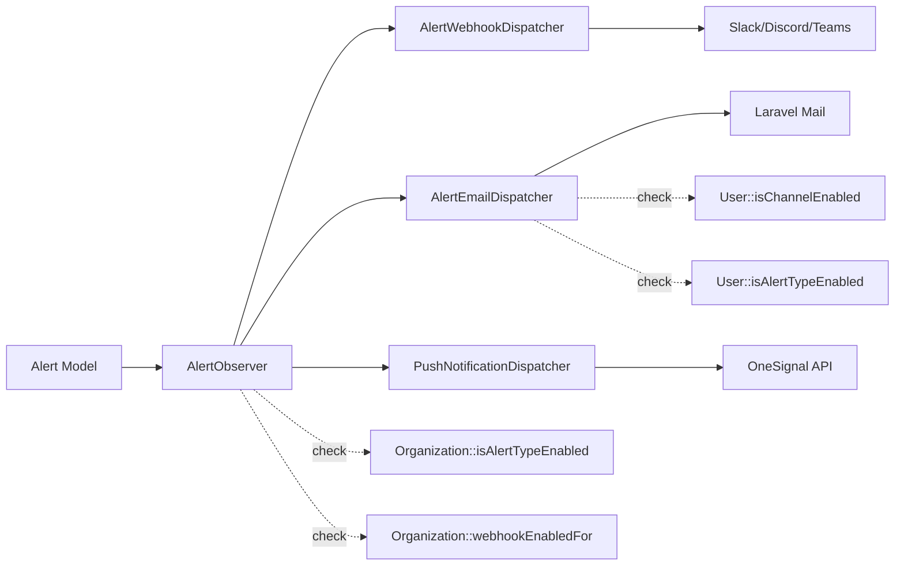

# 🕸️ Knowledge Graph — ImportnexCore

> **Motor:** `@modelcontextprotocol/server-memory` (MCP)
> **Formato:** Markdown con frontmatter, bi-direccional sync LLM

---

## Nodes primarios

### Tecnologías


### Módulos de negocio


### Skills activas (15)


---

## Relaciones clave

| Origen | Relación | Destino | Peso |
|---|---|---|---|
| Cars | `belongs_to` | Organization | 1.0 |
| Cars | `has_many` | Valuations | 0.8 |
| Organization | `has_one` | Subscription | 1.0 |
| MistralBridge | `calls` | Mistral API | 0.9 |
| StripeWebhookController | `processes` | PaymentFailed | 0.7 |
| HandleInertiaRequests | `shares` | i18n locale | 0.5 |

---

## Hot spots (alta complejidad)

| Archivo | Complejidad | Llamadas entrantes |
|---|---|---|
| `app/Services/ValuationImporter.php` | 🔴 32 | 4 |
| `app/Http/Controllers/Cars/CarController.php` | 🟠 18 | 12 |
| `app/Http/Middleware/HandleInertiaRequests.php` | 🟡 14 | ∞ |
| `resources/js/Pages/Cars/Show.vue` | 🟡 22 | 3 |

---

## Anti-patrones del grafo

- 🔴 `ValuationImporter` → sin tests de coverage (12 fallan pre-existentes)
- 🟠 `CarController` → sin Form Request (validación inline)
- 🟡 `i18n es.js/en.js` → ahora 92% sincronizadas (era 47% antes de auditoría)

## Sistema de Notificaciones (nuevo 2026-08-07)



## Marketplace Engagement (nuevo 2026-08-07)

```mermaid
graph LR
    A[MarketplaceIndex] --> B[WishlistButton]
    A --> C[CompareBar]
    A --> D[FilterBar]
    B -.localStorage.-> E[useWishlist composable]
    C -.router.visit.-> F[MarketplaceCompare]
    G[MarketplaceShow] --> H[FinancingCalculator]
    G --> B
    G --> I[ShareCar]
    D -.server-side.-> J[PublicMarketplaceController]
    J -.whitelist.-> K[FILTER_RULES]
    J -.paginate(12).-> L[MarketplaceIndex]
```

---

## Auditoría 2026-08-07 (13 bugs corregidos)

| ID | Tipo | Estado |
|---|---|---|
| C1 | Icono Vue no importado | ✅ |
| C2 | Import duplicado | ✅ |
| C3 | Helper no exportado | ✅ |
| C4 | Backend ignora frontend | ✅ |
| C5 | Prefs usuario muertas | ✅ |
| H1 | i18n desincronizado | ✅ |
| H2 | Pluralización no implementada | ✅ |
| H3 | Import onMounted faltante | ✅ |
| H5 | Color email no brand | ✅ |
| H6 | Filtros client-side | ✅ |
| H7 | SSR guard | ✅ |
| M2 | Global scope multi-tenant | ✅ |
| M6 | Test débil | ✅ |

---

## Hot spots actualizados (2026-08-07)

| Archivo | Complejidad | Notas |
|---|---|---|
| `app/Services/ValuationImporter.php` | 🔴 32 | 12 tests fallan pre-existentes |
| `app/Http/Controllers/Cars/CarController.php` | 🟠 18 | Sin Form Request |
| `app/Http/Middleware/HandleInertiaRequests.php` | 🟡 14 | Inertia shared props |
| `resources/js/Pages/Cars/Show.vue` | 🟡 22 | +i18n strings |
| `app/Observers/AlertObserver.php` | 🟢 8 | 3 dispatchers independientes |
| `app/Services/AlertEmailDispatcher.php` | 🟢 6 | N8 prefs usuario |
| `app/Http/Controllers/PublicMarketplaceController.php` | 🟡 12 | 12 filtros whitelist |

## Sync automático

```bash
# Regenerar grafo desde código
php scripts/memory-manager.php build-graph

# Ver hot spots
php scripts/memory-manager.php hot-spots

# Relaciones entre módulos
php scripts/memory-manager.php relations --source=Cars --depth=2
```
