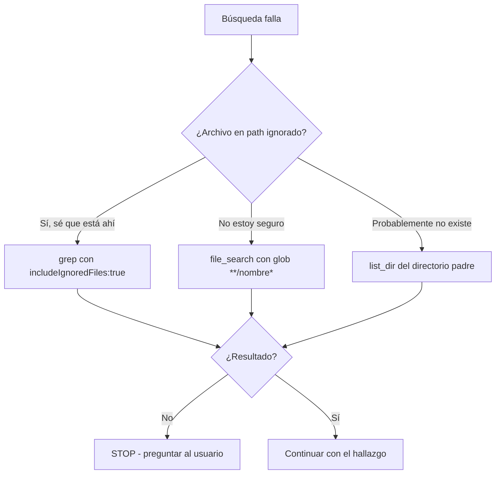

# 🔄 Anti-Loop — No repetir búsquedas fallidas

> **Problema que resuelve:** la IA repite `grep_search` con el mismo patrón que ya falló, gastando tokens y dando vueltas. Este es el loop más caro en sesiones de Copilot.

---

## Cuándo se activa

1. Una búsqueda devuelve **"No matches found"**.
2. La IA está a punto de repetir el **mismo patrón** con `includeIgnoredFiles: true` sin antes probar alternativas.
3. Se busca algo en un path que **podría estar excluido** (node_modules, vendor, storage, .git).

---

## Las 3 causas de "No matches found"

### Causa 1: El archivo realmente no existe
**Señal:** patrón razonable, archivo nunca creado.
**Fix:** `file_search` por glob más amplio, o `list_dir` del directorio padre.

### Causa 2: El patrón es demasiado específico (regex)
**Señal:** usaste regex compleja con escapes.
**Fix:** simplificar. Probar substring primero, luego regex.

### Causa 3: El archivo está en un directorio ignorado/excluido
**Señal:** el mensaje lista `[**/node_modules, **/bower_components, **/*.code-search]`.
**Fix:** usar `includeIgnoredFiles: true` SOLO si sabes que el archivo está en un path ignorado. Si no sabes, primero verifica con `file_search`.

---

## Regla de los 3 intentos (obligatoria)

**NUNCA hacer más de 3 intentos de búsqueda del mismo objetivo.**

| Intento | Acción | Herramienta |
|---|---|---|
| 1º | Búsqueda inicial (grep o file_search) | `grep_search` / `file_search` |
| 2º | Cambiar estrategia: simplificar patrón, ampliar glob, o `list_dir` del directorio | `file_search` con glob `**/nombre*` |
| 3º | Verificar existencia física con `list_dir` o `read_file` del parent | `list_dir` |

**Si 3 intentos fallan → STOP.** Decir al usuario: "No encuentro X. ¿Puedes confirmar la ruta?" No reintentar con `includeIgnoredFiles: true` a ciegas.

---

## Fallback decision tree



---

## Correcto vs incorrecto

### ❌ Loop incorrecto (gasta tokens)
```
grep "onesignal" app/          → No matches
grep "onesignal" app/ includeIgnoredFiles:true → No matches
grep "OneSignal" app/          → No matches  (misma estrategia)
grep "oneSignal" app/ includeIgnoredFiles:true → No matches
```

### ✅ Fallback correcto (1-2 intentos)
```
1. grep "onesignal" app/  → No matches
2. file_search "**/OneSignal*"  → encuentra Organization/Edit.vue
3. (sin necesidad de includeIgnoredFiles)
```

---

## Patrones comunes que fallan y su fix

| Patrón que falla | Causa real | Fix |
|---|---|---|
| `grep "model" app/Models` | Muy genérico | `file_search "**/*.php"` + list_dir |
| `grep "DeferredProp" app/` | Archivo en vendor (excluido) | `grep ... vendor/ includeIgnoredFiles:true` |
| `grep "onesignal" app/` | Caso del archivo diferente | Probar `OneSignal`, `onesignal`, `ONE_SIGNAL` |
| `grep "class Car" app/` | Regex con espacios | Simplificar a `"Car"` + file_search |
| `grep "Button" resources/` | node_modules excluido | scope a `resources/js` explícito |

---

## Reglas anti-gasto de tokens

1. **No** repetir `grep` con `includeIgnoredFiles:true` como primer fallback — solo si sabes que está ahí.
2. **Preferir** `file_search` (devuelve rutas, barato) sobre `grep` (devuelve contenido, caro) para localizar.
3. **Siempre** `list_dir` del directorio antes de grep en código desconocido.
4. **Máximo 3 intentos** por objetivo, luego preguntar.
5. **Escribir memoria** si el fallo era por un path ignorado inesperado (para no repetir).

---

## Comando rápido (memory-manager)

```bash
# Buscar si un archivo existe sin grep
php scripts/memory-manager.php find-file "OnboardingChecklist"

# Listar estructura de un dir
php scripts/memory-manager.php list-dir app/Http/Controllers
```

(Si estos comandos no existen aún, usar file_search + list_dir nativos.)

---

## Anti-pattern final

> ❌ "No matches found... a ver si con includeIgnoredFiles:true"
> ✅ "No matches found → pruebo file_search con glob amplio → si falla, list_dir → si falla, pregunto"
