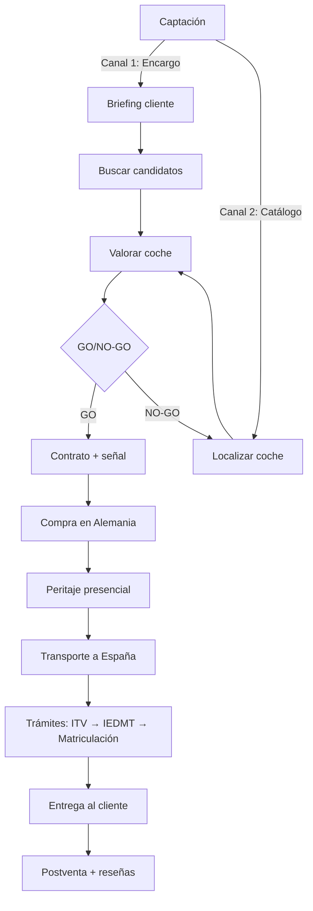

# JJ Import Motors — Documento maestro completo SaaS

**Versión:** 1.0 — 24 julio 2026
**Autor:** Jose Antonio
**Estado:** Planificación pre-implementación

---

## Tabla de contenidos

1. [Resumen ejecutivo](#1-resumen-ejecutivo)
2. [Modelo de negocio](#2-modelo-de-negocio)
3. [Estado actual del sistema](#3-estado-actual-del-sistema)
4. [Arquitectura técnica del SaaS](#4-arquitectura-técnica-del-saas)
5. [Modelo de datos](#5-modelo-de-datos)
6. [Fases de implementación](#6-fases-de-implementación)
7. [Legal y fiscalidad](#7-legal-y-fiscalidad)
8. [Marketing y presencia online](#8-marketing-y-presencia-online)
9. [Operaciones y red de proveedores](#9-operaciones-y-red-de-proveedores)
10. [Pendientes y roadmap](#10-pendientes-y-roadmap)

---

## 1. Resumen ejecutivo

### 1.1. Propuesta de valor

**JJ Import Motors** es un servicio profesional de importación de vehículos desde la Unión Europea hacia España. El producto no es el coche, es la **tranquilidad**: el cliente quiere un coche de Alemania y no sabe/no quiere lidiar con idioma, distancia, riesgo de fraude, trámites, ITV, impuestos y matriculación.

### 1.2. Canales de venta

| Canal | Cómo llega el cliente | Quién elige el coche |
|-------|----------------------|----------------------|
| **Encargo específico** | El cliente dice qué coche/tipo quiere y su presupuesto | El cliente (tú lo buscas) |
| **Catálogo / anuncio** | Tú localizas coches buenos, los anuncias con precio todo incluido | Tú (el cliente elige de tu oferta) |

Ambos canales terminan en el mismo proceso de importación y en la misma factura de servicio.

### 1.3. Diferenciadores competitivos

1. **Acceso** a coches que aquí no hay o son más caros
2. **Ahorro** real: incluso con tu servicio, sale a cuenta frente a comprar en España
3. **Sin riesgo / sin complicaciones:** filtras fraude, revisas y gestionas todo
4. **Transparencia:** el cliente sabe en todo momento cuánto cuesta y en qué punto está

---

## 2. Modelo de negocio

### 2.1. Estructura de precios (tarifa por tramos)

| Precio del coche | Tarifa de servicio |
|------------------|-------------------|
| Hasta 15.000 € | **1.500 €** |
| 15.000 – 30.000 € | **2.000 – 2.500 €** |
| Más de 30.000 € | **2.500 – 3.500 €** (o % del 8–10 %) |

- **1.500 € es el suelo:** no bajar de ahí. Tu tiempo, peritaje y trámites cuestan dinero real y asumes riesgo.
- Posibles **extras** con recargo: transporte premium, urgencia, coche de gama muy alta, desplazamiento largo.

### 2.2. Costes de importación (referencia 2026)

- Transporte: 1.000-1.800 €
- Peritaje: 300-600 €
- Gestión documental + COC: 300-500 €
- ITV/homologación: 200-400 €
- IEDMT: 0-14,75 % según CO₂
- Tasas DGT: ~100 €

**Total de importación habitual:** 2.500-6.000 € sobre el precio del coche.

### 2.3. Flujo de trabajo end-to-end



### 2.4. Fases detalladas

**FASE 0 — Captación**
- Canal 1: Lead → briefing (qué coche, presupuesto, plazos, imprescindibles)
- Canal 2: Tú localizas un coche bueno → lo valoras → lo anuncias

**FASE 1 — Valoración (skill actual)**
Ficha técnica, investigación (averías típicas, recalls, fiabilidad, comparables), coste total puesto en España.

**FASE 2 — Confirmación**
Cliente elige → tú aplicas GO/NO-GO técnico (no traes coche con recall grave o avería cara conocida).

**FASE 3 — Contrato + señal**
Contrato de encargo de importación (actúas como gestor, no vendedor), cliente paga señal.

**FASE 4 — Compra en Alemania**
Mensajes en alemán (estado, Scheckheft, COC, IVA), negociación, peritaje presencial, contrato Kaufvertrag.

**FASE 5 — Logística**
Transporte (camión o placas exportación Ausfuhrkennzeichen), seguro de transporte.

**FASE 6 — Trámites en España**
Secuencia crítica: ITV de importación → homologación si aplica → IEDMT (mod. 576, 30 días) → tasas DGT → matriculación. Plazo: 2-4 semanas.

**FASE 7 — Entrega**
Coche limpio, documentación completa (permiso, ficha técnica, COC, ITV, justificantes). Momento clave para reseñas y referidos.

**FASE 8 — Postventa**
Seguimiento, incidencias, activación del cliente como prescriptor.

---

## 3. Estado actual del sistema

### 3.1. Sistema actual (Cowork + Drive + JSON)

El sistema vive en dos sitios con roles distintos:

- **Panel de Cowork "jj-panel-operaciones"**: herramienta principal y única donde se edita. Lee y escribe directamente en Google Drive (`coches.json`, `clientes.json`, `contactos.json`).
- **`JJ_Centro_Operaciones.html`**: espejo de solo lectura para abrir con doble clic sin pasar por Cowork. Se regenera cada vez que cambian los datos.

### 3.2. Funcionalidades ya implementadas

**Panel de Cowork (Fase 1 y 2 completas):**
- ✅ Calculadora IEDMT con depreciación oficial por antigüedad
- ✅ Selector de escenario de IVA (margen/deducible/B2B)
- ✅ Semáforo automático por margen real vs. comparables
- ✅ Estimación de transporte automática por distancia (haversine)
- ✅ VIN destacado + autodetección desde Teil 2
- ✅ Subida y lectura automática de Teil 1/2/COC/Scheckheft (PDF)
- ✅ Facturas con detección automática de fecha e importe
- ✅ Checklist de inspección muy detallado (8 módulos)
- ✅ Historial de estados con fechas
- ✅ Pestaña "Fotos/Vídeos cliente" + descarga ZIP
- ✅ Módulo de Finanzas de empresa: ingresos/gastos, KPIs, gráficas
- ✅ Comparables de mercado con enlaces reales
- ✅ Vista Kanban por estado

**JJ_Centro_Operaciones.html:**
- Mapa real (Leaflet + OpenStreetMap)
- Vista de tarjetas con toggle
- Fichas completas con fotos/documentos
- Botones de alta/edición
- Asignación de cliente con buscador
- Dashboard de finanzas con gráficos

### 3.3. Datos actuales

**Coches:** 1 coche de prueba (Opel Astra OPC 2016, 98.000 km, 13.999 € en Hamburgo)
**Clientes:** Array vacío
**Contactos:** Array vacío

### 3.4. Limitaciones actuales

1. **El conector de Drive no sobrescribe archivos** — cada guardado crea versión nueva
2. **El artifact no puede cargar mapas ni imágenes externas** — por eso el mapa real va en archivo aparte
3. **Borrar en Drive es siempre manual** — ninguna herramienta del conector lo permite
4. **Datos en localStorage del navegador** — no accesible desde móvil

---

## 4. Arquitectura técnica del SaaS

### 4.1. Stack tecnológico

**Backend:**
- Laravel 11 (PHP 8.3)
- MySQL 8
- Laravel Fortify o Jetstream (auth)
- `spatie/laravel-permission` (roles/permisos)
- Laravel Horizon + Redis (colas/jobs)
- Laravel Cashier (Stripe, facturación SaaS)
- `barryvdh/laravel-dompdf` o `spatie/browsershot` (PDFs)

**Frontend:**
- Vue 3
- Inertia.js 2 (SPA-like sin API REST separada)
- Tailwind CSS
- Chart.js (gráficas)
- Leaflet + OpenStreetMap (mapas)

**Almacenamiento:**
- S3-compatible (AWS S3, DigitalOcean Spaces, Cloudflare R2)
- Filesystem driver de Laravel

**Testing:**
- Pest (o PHPUnit) para backend
- Vitest para componentes Vue

### 4.2. Multi-tenancy

**Enfoque recomendado:** single-database multi-tenancy con columna `organizacion_id` + global scopes de Eloquent.

**Por qué este enfoque:**
- Más simple y barato de operar que bases de datos separadas por cliente
- Solo migrar a esquemas separados si algún cliente grande lo exige por contrato

**Implementación:**
- Cada importador es una `organizacion` (tenant)
- Todas las tablas de negocio (coches, clientes, contactos, mensajes) tienen `organizacion_id`
- Global scope automático por `organizacion_id` en modelos de negocio
- Middleware que impide fugas de datos entre tenants (test dedicado obligatorio)

### 4.3. Arquitectura de almacenamiento de ficheros

**Sustituir Google Drive por S3-compatible:**
- Cada coche tiene una "carpeta" lógica (prefijo de ruta) para fotos y documentos
- No carpeta real de Drive
- Subida directa desde navegador (presigned URLs) para no cargar servidor
- Previsualización de PDFs/imágenes

**Ventajas:**
- Quita dependencia de que el usuario conecte su cuenta de Google
- Hace el producto vendible a terceros sin fricción de configuración
- Escalable y profesional

### 4.4. Extracción de datos por IA ("Verificar coche")

**Diseño:**
- Endpoint que recibe enlace
- Dispara Job en cola (no síncrono)
- Job: descarga página, extrae texto, llama API de Claude, guarda resultado
- Estado "pendiente de revisión"
- Notificación al usuario (Echo/websocket o polling)

**Ventaja:** no bloquea al usuario mientras se scrapea el anuncio.

### 4.5. Colas y jobs

Usos:
- Extracción por IA ("Verificar coche")
- Generación de PDFs
- Avisos automáticos
- Procesamiento batch

**Laravel Horizon** para monitoreo de colas.
**Redis** como driver de cola.

---

## 5. Modelo de datos

### 5.1. Tablas principales

```sql
-- Organizaciones (tenants)
organizaciones
  - id, nombre, plan, stripe_id, trial_ends_at

-- Usuarios
users
  - id, organizacion_id, nombre, email, password, rol

-- Coches
coches
  - id, organizacion_id, marca, modelo, version, anio, km
  - combustible, cambio, cv, co2
  - precio_coche, precio_nuevo, base_imp_manual
  - transporte, itv_imp, coc, tasas, honorarios, senal
  - vin, vendedor, ciudad, lat, lng
  - estado, enlace, semaforo, valoracion, recomendacion
  - cliente_id (nullable), notas
  - created_at, updated_at

-- Fotos de coches
coche_fotos
  - id, coche_id, url, orden

-- Documentos de coches
coche_documentos
  - id, coche_id, nombre, tipo, url, subido_en

-- Gastos reales vs. estimados
coche_gastos_reales
  - id, coche_id, concepto, estimado, real

-- Checklist de inspección
coche_checklist
  - id, coche_id, item_key, completado, completado_en

-- Clientes
clientes
  - id, organizacion_id, nombre, contacto
  - que_busca, presupuesto_min, presupuesto_max
  - estado, coche_elegido_id, notas

-- Historial de contacto con clientes
cliente_historial_contacto
  - id, cliente_id, fecha, canal, resumen

-- Contactos de negocio
contactos
  - id, organizacion_id, nombre, telefono, email, ciudad, notas
  - tags (json o tabla pivote contacto_tag)

-- Plantillas de mensajes (seed fijo)
mensajes_plantillas
  - id, nombre, contenido, idioma

-- Avisos automáticos
avisos
  - id, organizacion_id, tipo, referencia_id, mensaje, resuelto
```

### 5.2. Índices clave

```sql
INDEX(coches(organizacion_id, estado))
INDEX(clientes(organizacion_id, estado))
INDEX(coches(organizacion_id, cliente_id))
INDEX(avisos(organizacion_id, resuelto))
```

### 5.3. Estados de coches

```php
ESTADOS_COCHE = [
    'Localizado',
    'Valorando',
    'Ofrecido',
    'Reservado',
    'Comprado',
    'En_transito',
    'En_tramites',
    'Entregado',
    'Descartado'
];

ESTADOS_ACTIVOS = [
    'Localizado',
    'Valorando',
    'Ofrecido',
    'Reservado',
    'Comprado',
    'En_transito',
    'En_tramites'
];
```

---

## 6. Fases de implementación

### Fase 0 — Cimientos (3-5 días)

**Objetivo:** Infraestructura base del proyecto.

**Tareas:**
- [ ] Crear repo Laravel + Inertia + Vue con Breeze/Jetstream
- [ ] Configurar CI básico (lint + tests en cada push)
- [ ] Configurar entornos: local Docker/Sail, staging, producción
- [ ] Configurar colas y Redis
- [ ] Configurar filesystem S3-compatible

**Entregables:**
- Proyecto Laravel funcional en local
- Tests ejecutándose en CI
- Entorno de staging accesible

---

### Fase 1 — Multi-tenancy, auth y roles (3-4 días)

**Objetivo:** Sistema de usuarios con aislamiento de datos por tenant.

**Tareas:**
- [ ] Modelo `organizaciones` + migración
- [ ] Registro de nueva organización (onboarding)
- [ ] Login con Fortify/Jetstream
- [ ] Roles: dueño (owner), operador
- [ ] Global scope automático por `organizacion_id` en modelos de negocio
- [ ] Middleware anti-fugas de datos entre tenants
- [ ] Test dedicado que verifique aislamiento

**Entregables:**
- Registro y login funcional
- Aislamiento de datos probado con tests
- Roles implementados

---

### Fase 2 — Modelo de datos y migraciones (2-3 días)

**Objetivo:** Todas las tablas de negocio listas.

**Tareas:**
- [ ] Migraciones de todas las tablas (sección 5.1)
- [ ] Factories y seeders con datos de ejemplo
- [ ] **Script de importación** que lee `coches.json` / `clientes.json` / `contactos.json` de Drive y los vuelca a MySQL
- [ ] Índices de rendimiento

**Entregables:**
- Esquema completo de BD
- Datos de prueba
- Script de importación funcional

---

### Fase 3 — Coches: CRUD completo (6-8 días)

**Objetivo:** Gestión completa de vehículos.

**Tareas:**
- [ ] Listado con tabla ordenable/filtrable (Inertia)
- [ ] Vista de tarjetas con toggle
- [ ] Ficha completa (fotos, documentos, checklist, gastos reales vs. estimados)
- [ ] Formulario de alta/edición
- [ ] Subida de fotos y documentos a S3
- [ ] Asignación de cliente con buscador
- [ ] Portar calculadora de IEDMT/honorarios/transporte (composable Vue + equivalente PHP)
- [ ] Validaciones en backend

**Entregables:**
- CRUD de coches completo
- Calculadora portada y verificada
- Fichas funcionales

---

### Fase 4 — Clientes y contactos (4-5 días)

**Objetivo:** Gestión de CRM ligero.

**Tareas:**
- [ ] CRUD de clientes con historial de contacto
- [ ] Matching automático de clientes contra inventario
- [ ] CRUD de contactos con tags
- [ ] Búsqueda y filtro por tag
- [ ] Pipeline simple: Nuevo → Briefing → Presupuesto → Negociando → Encargo → En proceso → Entregado

**Entregables:**
- CRM funcional
- Matching cliente-coche
- Pipeline de leads

---

### Fase 5 — "Verificar coche" con IA (4-6 días)

**Objetivo:** Extracción automática de datos de anuncios.

**Tareas:**
- [ ] Endpoint POST `/api/coches/verificar`
- [ ] Job en cola: descarga página → extrae texto → llama API de Claude → guarda JSON
- [ ] Estado "pendiente de revisión" con polling o Echo
- [ ] Modal de Guardar/Descartar cuando esté listo
- [ ] Prompt estructurado (mismo que `askClaude` actual)

**Entregables:**
- Verificación de coches funcional
- UX con notificaciones
- Job en cola probado

---

### Fase 6 — Plantillas de mensaje (2 días)

**Objetivo:** Biblioteca de mensajes reutilizable.

**Tareas:**
- [ ] Seed de plantillas (catálogo del producto, no por tenant)
- [ ] Resolución de placeholders (`{{nombre}}`, `{{coche}}`, etc.)
- [ ] Botón copiar en interfaz
- [ ] Idiomas: ES, EN, DE

**Entregables:**
- Biblioteca de plantillas funcional
- Interfaz de uso

---

### Fase 7 — Vistas de mapa, kanban y finanzas (5-7 días)

**Objetivo:** Visualización avanzada.

**Tareas:**
- [ ] Mapa Leaflet con clustering
- [ ] Vista kanban por estado con arrastrar/soltar
- [ ] Avisos en kanban (coches parados >X días, clientes sin contactar >7 días)
- [ ] Dashboard de finanzas con gráficos (Chart.js)
- [ ] Organizador de viaje: agrupación por cercanía + ruta + coste estimado

**Entregables:**
- Mapa funcional
- Kanban con avisos
- Finanzas con KPIs
- Organizador de viajes

---

### Fase 8 — Documentos y almacenamiento (3-4 días)

**Objetivo:** Gestión profesional de ficheros.

**Tareas:**
- [ ] Patrón de "carpeta por coche" a prefijos S3
- [ ] Subida directa desde navegador (presigned URLs)
- [ ] Previsualización de PDFs/imágenes
- [ ] Organización por tipo: COC, ITV, contrato, facturas

**Entregables:**
- Almacenamiento S3 funcional
- UX de subida fluida
- Previsualizaciones

---

### Fase 9 — Facturación SaaS (4-5 días)

**Objetivo:** Sistema de pagos y suscripciones.

**Tareas:**
- [ ] Integrar Cashier + Stripe
- [ ] Planes: por nº de coches activos o por usuario
- [ ] Página de facturación
- [ ] Trial gratuito (ej. 14 días)
- [ ] Webhook de Stripe para bajas/impagos

**Entregables:**
- Checkout de pago funcional
- Gestión de suscripciones
- Webhook configurado

---

### Fase 10 — Migración de datos reales (1-2 días)

**Objetivo:** Importar datos históricos.

**Tareas:**
- [ ] Ejecutar script de importación de Fase 2 contra datos reales
- [ ] Verificar cifras: coste total, IEDMT, checklist
- [ ] Comparar con panel de Cowork antes de apagarlo
- [ ] Validar que todos los datos migraron correctamente

**Entregables:**
- Datos migrados
- Validación completada
- Documento de reconciliación

---

### Fase 11 — QA, deployment y dominio (3-4 días)

**Objetivo:** Producción estable.

**Tareas:**
- [ ] Tests end-to-end de flujos críticos: alta coche, verificar coche, cierre operación
- [ ] Despliegue en Laravel Forge/Vapor o Docker+VPS
- [ ] Dominio propio
- [ ] Backups automáticos: MySQL + bucket S3
- [ ] SSL certificado
- [ ] Monitoreo básico (Uptime, logs)

**Entregables:**
- Producción estable
- Tests verdes
- Backups configurados

---

### Fase 12 — Lanzamiento (1-2 días)

**Objetivo:** Primera organización en producción.

**Tareas:**
- [ ] Migrar JJ Import Motors como primer tenant
- [ ] Verificar que todo funciona en producción
- [ ] Apagar flujo de Cowork/Drive una vez verificado
- [ ] Documentación básica para futuros importadores
- [ ] Onboarding del primer tenant externo (si aplica)

**Entregables:**
- Sistema SaaS en producción
- JJ Import Motors migrado
- Documentación de usuario

---

## 7. Legal y fiscalidad

### 7.1. Forma jurídica y alta

**Prioridad #1:** Estás **sin alta**. Para cobrar por un servicio y facturar legalmente necesitas darte de alta.

**Recomendación:**
1. **Ahora:** alta como autónomo (Hacienda modelo 036/037 + epígrafe IAE + alta RETA SS)
2. **Después:** SL cuando volumen y beneficio lo justifiquen (protege patrimonio, mejor imagen)

**Confirma con gestor:**
- Epígrafe IAE exacto
- Momento del salto a SL
- Circuitos de IVA/IEDMT una vez tengas primera operación real

### 7.2. Fiscalidad — tres impuestos clave

**1. IVA (tu servicio):**
- Tu tarifa lleva **IVA 21%**
- Lo repercutes al cliente y declaras (modelo 303 trimestral, 390 anual)
- Deduces IVA de gastos (transporte, herramientas, etc.)
- Como solo prestas servicio y no revendes coches, no entras en REBU

**2. IEDMT (impuesto de matriculación):**
- Lo paga **el cliente** (coche se matricula a su nombre)
- Depende del **CO₂ homologado** → **COC es crítico**
- Sin CO₂, Hacienda puede aplicar tramo alto y disparar coste
- Tramos oficiales (península): 0% (<120), 4,75% (120-159), 9,75% (160-199), 14,75% (≥200 g/km)

**3. IRPF (autónomo) / Impuesto de Sociedades (SL):**
- Tributas por tu beneficio
- Lleva las cuentas desde el día uno

### 7.3. IVA del coche — dos escenarios

**Caso habitual (margen):**
- IVA ya pagado en origen
- No se desglosa ni deduce
- No se vuelve a pagar en España
- Solo se paga IEDMT

**Caso B2B con NIF intracomunitario:**
- Factura sin IVA alemán
- Se **autoliquida** en España (adquisición intracomunitaria)

**En el servicio:**
- Tu tarifa de servicio sí lleva IVA español (21%)
- El coche lo importa el cliente

### 7.4. Figura contractual y responsabilidad

**Tu figura: gestor/intermediario (NO vendedor)**

**Por qué importa:**
- Como gestor: el cliente es comprador del coche; tú prestas servicio
- No asumes garantía del vehículo como vendedor, sino responsabilidad por tu servicio
- Menor exposición legal

**Canal catálogo (anuncios):**
- Al anunciar tú el coche concreto, te acercas visualmente a figura de vendedor
- **Protección explícita en anuncio y contrato:**
  - Redactar como *"servicio de importación de este vehículo"*, no *"vendo este coche"*
  - Dejar claro que actúas como gestor/intermediario
  - El comprador/importador es el cliente
- **Cerrar esta redacción con abogado antes de publicar primer coche**
- Es la decisión legal más importante del negocio

### 7.5. Contratos que necesitas

1. **Contrato de encargo de importación** (con el cliente):
   - Objeto, presupuesto, señal, plazos
   - Tu papel como gestor
   - Qué pasa si coche no supera peritaje
   - Límites de responsabilidad

2. **Contrato de compraventa alemán** (Kaufvertrag) con vendedor

3. **Condiciones de servicio** y textos legales de anuncios

### 7.6. Otros

- **RGPD:** guardas datos de clientes (nombre, DNI, teléfono, email). Trátalos con base legal, cuidado y sin compartir.
- **Documentación de importación:** archiva COC, contratos, ITV, justificantes IEDMT y transporte por operación.
- **Publicidad veraz:** nada de prometer plazos o ahorros que no puedas cumplir.

---

## 8. Marketing y presencia online

### 8.1. Marca

**Identidad visual:**
- Logo, 2 colores, tipografía
- Aplicada a todo: anuncios, presupuestos, dossieres, redes, web
- Coherencia = profesionalidad

**Colores:**
- Estoril Blue `#1A306D`
- Asphalt Grey `#38393D`
- Platinum Silver `#BEC0C3`

**Posicionamiento:**
*"Importa tu coche de Alemania sin riesgos ni complicaciones. Yo me encargo de todo."*

### 8.2. Presencia (dónde te encuentran)

**Google Business Profile** (ficha en Google/Maps):
- Imprescindible para búsquedas locales y SEO local
- Acumular reseñas (oro puro para confianza)
- Gratis y de altísimo impacto

**Web/landing:**
- Qué haces, cómo funciona (los pasos)
- Catálogo de coches disponibles (canal 2)
- Casos reales
- Formulario/calculadora de presupuesto (canal 1)
- No necesitas web cara

**WhatsApp Business:**
- Canal por el que te escribirán
- Respuestas rápidas
- Catálogo
- Mensaje de bienvenida

### 8.3. Contenido en redes

**Lo que funciona:**
- **Coches del catálogo** (canal 2): cada coche que localizas es contenido listo
- **Casos reales:** "Le traje este Golf a un cliente de Valencia"
- **Educativo:** "¿Cuánto cuesta de verdad importar?", "3 errores al importar", "¿Merece la pena?"
- **Detrás de cámaras:** peritaje, transporte, entrega
- **Testimonios y entregas** (cliente con su coche)

**Plataformas:**
- **Instagram/TikTok:** carrusel de 6-10 fotos + reel corto
- **Facebook:** carrusel + post más largo
- **YouTube Shorts:** vídeo vertical, primeros 2s con gancho

### 8.4. Publicidad (cuando tengas base)

- **Google Ads:** búsquedas tipo "importar coche alemania" (alta intención)
- **Meta Ads:** coches del catálogo + remarketing

Empieza orgánico; añade pago cuando tengas web, reseñas y casos.

### 8.5. Publicación automática — qué es posible

| Plataforma | ¿Automático? | Cómo | Notas |
|------------|--------------|------|-------|
| Instagram | Sí, vía API | Meta Graph API | Requiere cuenta Business/Creator + app + revisión (2-4 semanas) |
| Facebook | Sí, vía API | Misma API de Meta | Igual que IG |
| TikTok | Sí, vía API | Content Posting API | Requiere OAuth + auditoría; hasta pasarla, posts privados |
| Wallapop | Solo profesional | Wallapop Motor + hub | No hay API abierta para vendedor pequeño |
| Milanuncios/coches.net | Solo profesional | DMS o hub multipublicación | Milanuncios: 2 gratis; más vía profesional |

**Recomendación:**
- **Redes:** usa programador (Metricool, Publer, Buffer, Later). Claude genera contenido → tú pegas/programas → se publica solo. 90% del beneficio con 10% del esfuerzo.
- **Portales:** manual al principio; valorar hub tipo Inventario.pro solo con 10+ coches/mes.

**Evita:** bots no oficiales de Wallapop (van contra condiciones de uso).

---

## 9. Operaciones y red de proveedores

### 9.1. Red de proveedores necesaria

- **Peritos/mecánicos de confianza en Alemania** (o plan para desplazarte tú)
- **2-3 transportistas fiables** para comparar precio y disponibilidad
- **Gestoría de importación/matriculación en España**
- **Taller ITV de confianza**
- **Servicio de limpieza/detailing** para la entrega
- **Checklist de entrega final** al cliente (documentación + estado)

### 9.2. Checklist de entrega final

- Documentación completa:
  - Permiso de circulación
  - Ficha técnica
  - COC
  - ITV
  - Justificantes de IEDMT
  - Justificante de transporte
- Coche limpio y revisado
  - Limpieza interior/exterior
  - Niveles de líquidos correctos
  - Presión de neumáticos
- Explicación breve del coche al cliente
- Formulario de satisfacción + petición de reseña
- Instrucciones de postventa (qué hacer si hay incidencias)

### 9.3. Trámites en España — orden crítico

1. **ITV de importación**
2. **Homologación** (si aplica)
3. **IEDMT** (modelo 576, en 30 días tras entrada)
4. **Tasas DGT**
5. **Matriculación**
6. **IVTM** (impuesto municipal vehículos de tracción mecánica)

**Plazo típico:** 2-4 semanas desde compra.

### 9.4. Documentación de Alemania

- **Kaufvertrag** (contrato de compraventa)
- **COC** (Certificate of Conformity) — crítico para IEDMT
- **Fahrzeugbrief/Fahrzeugschein** (ficha técnica)
- **Scheckheft** (historial de mantenimiento) — muy valioso
- **Abmeldung** (baja de matrícula alemana)
- **Ausfuhrkennzeichen** (placas de exportación, válidas hasta 12 meses) + Grenzversicherung (seguro, 30-60 €) O transporte en camión (900-1.200 €)

---

## 10. Pendientes y roadmap

### 10.1. Pendientes urgentes (legal/administración)

- [ ] **Alta como autónomo** (Hacienda + SS)
- [ ] **Cerrar con abogado** tu figura de gestor/intermediario y redacción exacta de contratos/anuncios
- [ ] Redactar contrato de encargo de importación
- [ ] Redactar texto legal estándar para anuncios del canal catálogo
- [ ] Cuenta bancaria separada para el negocio
- [ ] Confirmar con gestor: epígrafe IAE, momento de salto a SL, circuito IVA/IEDMT
- [ ] Seguros: responsabilidad civil profesional + seguro de transporte por operación

### 10.2. Pendientes — Panel digital (Fase 3, 4, 5)

**Fase 3 — Centralizar y alojar:**
- [ ] Pasar `coches.json`/`finanzas.json` de localStorage a **Google Sheet**
- [ ] **Hosting** del panel (Netlify/Cloudflare Pages, gratis)
- [ ] Dominio propio `jjimportmotors.com` (~10-15 €/año)
- [ ] Auto-upload a Drive por OAuth

**Fase 4 — Automatizar:**
- [ ] Botón "evaluar enlace" en panel que dispara valoración directamente
- [ ] Tarea programada: informe mensual de KPIs
- [ ] Tarea programada: seguimiento de leads
- [ ] Generación en lote de contenido desde ficha

**Fase 5 — Extras pro:**
- [ ] Informe de historial (Carvertical/autoDNA vía API)
- [ ] Calculadora pública para clientes (captación leads)
- [ ] CRM de clientes ligado a coches
- [ ] Firma digital de contratos
- [ ] Multi-idioma en web (ES/EN/DE)
- [ ] Base BOE real por coche investigada automáticamente

### 10.3. Pendientes — Marca y presencia online

- [ ] Poner tu número de WhatsApp real en `JJ_Import_Motors_Landing.html`
- [ ] Subir landing a hosting gratis (Netlify Drop)
- [ ] Dominio propio (ver Fase 3 del panel)
- [ ] Identidad visual aplicada a todo
- [ ] Google Business Profile
- [ ] WhatsApp Business configurado
- [ ] Calendario de contenido para redes

### 10.4. Pendientes — Comercial y CRM

- [ ] Definir **reglas de margen mínimo** y **banderas rojas** por escrito
- [ ] Pipeline de leads (hoja simple o CRM gratuito)
- [ ] Definir precio de servicio por tramos definitivo
- [ ] Plantillas de mensaje por fase del pipeline

### 10.5. Pendientes — Operaciones

- [ ] Red de peritos/mecánicos en Alemania
- [ ] 2-3 transportistas fiables
- [ ] Gestoría de importación en España
- [ ] Taller ITV de confianza
- [ ] Servicio de limpieza/detailing
- [ ] Checklist de entrega final

### 10.6. Pendientes — Contenido y publicación

- [ ] Plantilla de folleto PDF de venta con marca
- [ ] Paquete de contenido estandarizado por coche
- [ ] Elegir programador de redes (Metricool/Publer/Buffer)
- [ ] Publicación en portales (manual al principio)
- [ ] Informe mensual de KPIs

### 10.7. Roadmap recomendado

**Orden sugerido (por impacto/esfuerzo):**

1. **A1 + A2** (mapa real + geocodificación) — lo que más pides
2. **B2** (avisos automáticos) — máximo valor por esfuerzo mínimo
3. **Legal/administración** (alta autónomo + abogado) — lo más urgente
4. **B1** (checklists en kanban) — convierte panel en herramienta de trabajo real
5. **C1** (reales vs. estimados) — a partir de 3ª-4ª operación real empieza a pagar
6. El resto según lo vayas necesitando

---

## Anexos

### A. Fórmula IEDMT

```
Base imponible = precio nuevo oficial × coeficiente depreciación por antigüedad

Coeficientes oficiales (península):
- 100%: < 1 año
- 84%: 1-2 años
- 68%: 2-3 años
- 57%: 3-4 años
- 47%: 4-5 años
- 39%: 5-6 años
- 33%: 6-7 años
- 28%: 7-8 años
- 24%: 8-9 años
- 19%: 9-10 años
- 14%: 10-11 años
- 10%: > 12 años

IEDMT = Base imponible × % según CO₂

Tramos CO₂:
- 0%: < 120 g/km
- 4,75%: 120-159 g/km
- 9,75%: 160-199 g/km
- 14,75%: ≥ 200 g/km

Nota: Canarias, Ceuta y Melilla tienen tipos propios.
```

### B. Banderas rojas automáticas (NO-GO o investigación extra)

- Precio muy por debajo de mercado sin explicación
- Recall grave sin resolver
- Avería conocida y cara típica de ese motor
- Muchos propietarios en poco tiempo
- Vendedor profesional que oculta historial/sin COC

### C. Reglas de decisión

**Regla de margen:**
- Fija **margen mínimo objetivo** (ej. X € o X% sobre inversión total)
- Si estimación no lo alcanza en escenario **realista**, es NO-GO por defecto
- Si escenario **pesimista** da pérdidas, NO-GO salvo motivo claro

**Reglas de pricing de venta:**
- Canal catálogo: anuncia **precio todo incluido** (coche + servicio + trámites)
- Canal encargo: presenta **presupuesto desglosado**
- Define qué es cerrado y qué es estimado (IEDMT hasta confirmar CO₂)

### D. Plantilla de anuncio (ejemplo)

**Wallapop:**

```
🚗 BMW Serie 3 320d Pack M · 2020 · 78.000 km

Te lo importo de Alemania y te lo entrego MATRICULADO en España, listo para circular. Precio cerrado todo incluido.

✅ PRECIO TODO INCLUIDO: 28.900 €
(coche + transporte + ITV + impuesto + trámites + mi servicio)

📋 Ficha:
· Combustible: Diésel
· Cambio: Automático
· Potencia: 190 CV
· Kilómetros: 78.000 km
· Color: Gris Mineral

⭐ Equipamiento: Pack M, faros LED, navegación, cuero, cámara

🔧 Coche revisado y peritado. Historial completo y COC incluido.

📍 Entrega en Valencia (y resto de España).
📲 WhatsApp: 6XX XXX XXX

——
Servicio de gestión de importación. El vehículo se importa y matricula a nombre del cliente; JJ Import Motors actúa como gestor/intermediario.
```

### E. Checklist de peritaje (8 módulos)

1. **Estado general** (carrocería, pintura, golpea)
2. **Mecánico** (motor, transmisión, escapes, ruidos)
3. **Interior y equipamiento** (tapicería, electrónica, aire)
4. **Neumáticos y frenos** (medida, desgaste, pastillas)
5. **Documentación** (Kaufvertrag, COC, Scheckheft, matrícula)
6. **Historial y mantenimiento** (recambios, averías, recalls)
7. **Prueba de conducción** (arranque, cambios, frenado, dirección)
8. **Diagnóstico OBD** (códigos de fallo, ready codes)

---

## Resumen final

**Tiempo estimado de desarrollo SaaS:** 40-55 días jornada completa (una persona), repartidos en 13 fases.

**MVP vendible:** Fases 0-6 + 9-11 → ~6-7 semanas.

**Roadmap recomendado antes de arrancar desarrollo:**
1. Resolver legal/administración (alta autónomo + abogado + contratos)
2. Definir reglas de negocio (márgenes, banderas rojas, precios)
4. Montar presencia online mínima (landing + Google Business + WhatsApp)
5. Tener 1-2 operaciones completas del sistema actual para validar

**Próximos pasos:**
1. Priorizar: legal/administración primero
2. Validar: hacer 1-2 operaciones con sistema actual
3. Planificar: fijar fechas de inicio de cada fase
4. Arrancar: Fase 0 (cimientos) cuando esté todo listo

---

**Fin del documento maestro** — Versión 1.0, 24 julio 2026