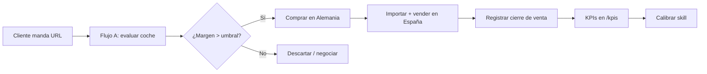

# Guías de uso — Skill Importación de Vehículos

> **Para:** Equipo de JJ Import Motors (Huelva)
> **Qué es:** Uso diario del skill `importacion-vehiculos` (importar coches de Alemania sin stock, cobrando honorarios).
> **Actualizado:** 2026-08-15 (skill v2.9.0)

---

## Índice

| Guía | Contenido | Cuándo leerla |
|------|-----------|---------------|
| [01-primeros-pasos](01-primeros-pasos.md) | Arranque, verificación de sincronización, presupuesto de peticiones | Primera vez + cada sesión |
| [02-flujo-a-unidad](02-flujo-a-unidad.md) | Evaluar un coche concreto (URL) | Al recibir una URL de un cliente |
| [03-flujo-b-modelo](03-flujo-b-modelo.md) | Investigar un modelo (buscar oportunidades) | Antes de comprar un modelo |
| [04-flujo-c-mercado](04-flujo-c-mercado.md) | Escanear el mercado (oportunidades) | Revisión periódica de mercado |
| [05-flujo-d-descubrimiento](05-flujo-d-descubrimiento.md) | Descubrir modelos/motorizaciones que encajan | No tienes modelo claro |
| [06-informes](06-informes.md) | Leer informes de valoración + briefing PDF | Al entregar a cliente |
| [07-cierre-venta](07-cierre-venta.md) | Registrar ventas y ver KPIs en `/kpis` | Cada venta / fin de mes |
| [08-solucion-problemas](08-solucion-problemas.md) | FAQ y troubleshooting | Cuando algo falla |

---

## Resumen de 30 segundos

1. **Empieza la sesión** con el arranque del skill (verifica sincronización Desktop).
2. **Dile al skill** qué quieres: una URL (Flujo A), un modelo (Flujo B) o escanear mercado (Flujo C).
3. **Recibe el informe** de valoración con veredicto (Comprar / Dudoso / Descartar) + briefing PDF.
4. **Registra cada venta** (o no-venta) para alimentar los KPIs.
5. **Consulta `/kpis`** en la app para ver precisión, tiempo hasta venta y desviación de precio.

---

## Flujo del negocio

