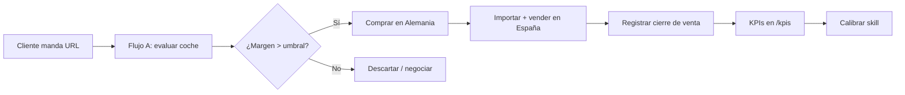

# Guías de uso — Skill Importación de Vehículos

> **Para:** Equipo de JJ Import Motors (Huelva)
> **Qué es:** Uso diario del skill `importacion-vehiculos` (importar coches de Alemania sin stock, cobrando honorarios).
> **Actualizado:** 2026-09-13 (skill **v3.9.7**)
> **Skill hermana:** `estudio-mercado` (v0.4.4) — estudia el mercado y deja el mapa `datos_mercado.json` que esta skill consulta **antes** de buscar. Ver [`../SKILLS.md`](../SKILLS.md).

---

## Índice

| Guía | Contenido | Cuándo leerla |
|------|-----------|---------------|
| [01-primeros-pasos](01-primeros-pasos.md) | Arranque, verificación de sincronización, presupuesto de peticiones | Primera vez + cada sesión |
| [02-flujo-a-unidad](02-flujo-a-unidad.md) | Evaluar un coche concreto (URL) | Al recibir una URL de un cliente |
| [03-flujo-b-modelo](03-flujo-b-modelo.md) | Investigar un modelo (buscar oportunidades) | Antes de comprar un modelo |
| [04-flujo-c-mercado](04-flujo-c-mercado.md) | Escanear el mercado (oportunidades) | Revisión periódica de mercado |
| [05-flujo-d-descubrimiento](05-flujo-d-descubrimiento.md) | Descubrir modelos/motorizaciones que encajan | No tienes modelo claro |
| [06-informes](06-informes.md) | Leer informes de valoración + briefing PDF | Al entregar a cliente |
| [07-cierre-venta](07-cierre-venta.md) | Registrar ventas y ver KPIs en `/kpis` | Cada venta / fin de mes |
| [08-solucion-problemas](08-solucion-problemas.md) | FAQ y troubleshooting | Cuando algo falla |

---

## 🗣️ Cómo pedirlo — ejemplos reales

No hace falta aprender jerga: **describe lo que quieres con tus palabras**. El skill detecta
solo qué flujo aplicar. Estas son las frases que disparan cada uno:

| Lo que quieres | Se lo dices así | Flujo |
|---|---|---|
| Evaluar **un coche concreto** de un anuncio | *"Mira este coche: `<URL del anuncio>`"* | **A · UNIDAD** |
| Investigar **un modelo** y sus oportunidades | *"Busca un VW Golf GTI, 2019+, hasta 32.000 €"* | **B · MODELO** |
| Revisar **una familia de coches** y sus rivales por marca | *"Quiero revisar **SUVs deportivas**: Audi RSQ3, Tiguan R y similares. Dame un plan de búsqueda **por marca** con sus modelos equivalentes"* | **C · MERCADO** |
| No sabes qué modelo, solo **presupuesto y requisitos** | *"Familiar 5p, gasolina, menos de 25.000 €, ¿qué opciones hay?"* | **D · DESCUBRIMIENTO** |
| Quieres **stock para ofertar** (varios candidatos) | *"Consígueme 5 Golf GTI para ofertar"* | **E · STOCK** |

> **Flujo M (marketing)** no se pide: se dispara solo cuando un Flujo A termina con veredicto 🟢.
>
> ⚠️ Si tu encargo **no encaja** en ninguno, el skill **debe preguntarte** qué flujo aplicar.
> Nunca improvisa. Si ves que se lo salta, avísale.

**El caso del segmento (C) es el más rentable**: le das 2-3 modelos conocidos y él completa la
familia con los rivales de cada marca, midiendo todos con la misma vara. El detalle está en
[`04-flujo-c-mercado.md`](04-flujo-c-mercado.md#1b-revisar-un-segmento-desde-modelos-conocidos--el-caso-más-habitual).

---

## Resumen de 30 segundos

1. **Empieza la sesión** con el arranque del skill (verifica sincronización Desktop).
2. **Dile al skill** qué quieres, con tus palabras: una URL (A), un modelo (B), una familia de coches (C), solo presupuesto (D) o stock para ofertar (E). Ver la tabla de arriba.
3. **Recibe el informe** con veredicto (🟢 Comprar / 🟡 Dudoso / 🔴 Descartar) + briefing PDF.
4. **Registra cada venta** (o no-venta) para alimentar los KPIs.
5. **Consulta `/kpis`** en la app para ver precisión, tiempo hasta venta y desviación de precio.

> **Antes de cualquier búsqueda**, el skill mira el mapa de mercado (`datos_mercado.json`, que
> mantiene la skill `estudio-mercado`). Si el modelo ya está medido y fresco, te lo dice **sin
> gastar peticiones**. Por eso conviene tenerlo actualizado.

---

## Flujo del negocio

